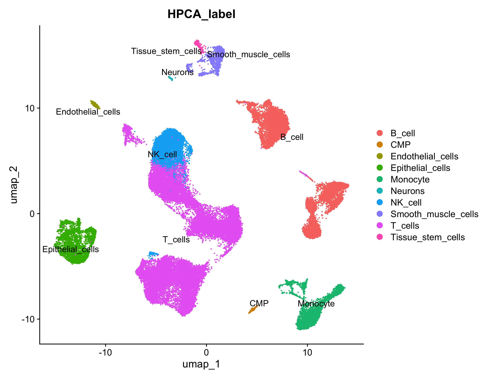
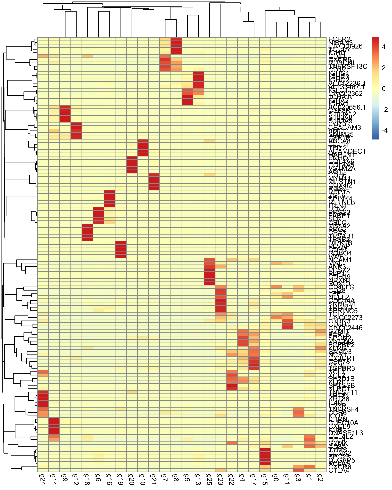

# Single-Cell RNA-Seq Processing & Automated Annotation Pipeline

Este repositório contém um pipeline de bioinformática otimizado focado no processamento, controle de qualidade estrito e anotação celular automatizada de dados de sequenciamento de RNA de célula única (scRNA-seq) em larga escala, utilizando o conjunto de dados público **GSE236581** (Câncer Colorretal - Bloqueio de Checkpoint Imunológico).

O fluxo de trabalho foi desenhado especificamente para superar as barreiras de uso intensivo de memória RAM em grandes matrizes complexas, utilizando recursos avançados do **Seurat v5** em ambiente **R**, integrando mapeamento fenotípico por cluster via **SingleR**.

> **Nota:** Os arquivos de dados originais (matrizes e metadados) são protegidos por restrições de tamanho e armazenamento do GitHub. Siga as instruções descritas na seção de execução para fazer o download das dependências do GEO.

---

## 🚀 Funcionalidades do Pipeline

* **Estruturação e Modularização em Seurat v5 (R):** Aplicação das camadas e estruturas nativas do Seurat v5 para manipulação eficiente de matrizes esparsas de expressão.
* **Gestão Estrita de Memória (Otimização):** Definição programática e controle de limites críticos de memória virtual (`R_MAX_VSIZE = "60Gb"`) e rotinas de coleta de lixo (`gc()`), permitindo o processamento fluido de grandes volumes de dados.
* **Filtros Adaptativos de Controle de Qualidade (QC):** Métricas avançadas baseadas em expressão celular, detecção de proporção mitocondrial e ribossomal para remoção sistemática de células de baixa qualidade ou dubletos (*doublets*).
* **Estratégia Crítica de Downsampling:** Amostragem estatisticamente robusta para estabilizar a matriz em 50.000 células representativas, prevenindo estouro de memória em etapas pesadas de escalonamento.
* **Anotação de Identidade Celular por Cluster:** Classificação fenotípica automatizada por meio de correlação de perfis transcriptómicos contra o framework de referência *Human Primary Cell Atlas* (HPCA) usando `SingleR`.

---

## 📂 Estrutura do Repositório

```text
├── data/
│   ├── GSE236581_barcodes.tsv.gz        # Barcodes das células do GEO (GSE236581)
│   ├── GSE236581_features.tsv.gz        # ID e símbolos oficiais dos genes (GEO)
│   ├── GSE236581_counts.mtx.gz          # Matriz de contagem bruta comprimida (GEO)
│   └── GSE236581_CRC-ICB_metadata.txt.gz# Metadados clínicos dos pacientes e amostras
├── scripts/
│   └── pipeline_scrna.R                 # Pipeline R principal (QC, Seurat, SingleR)
├── results/                             # Diretório gerado automaticamente com os outputs
│   ├── QC_Scatter.png                   # Correlação de QC e dispersão celular
│   ├── UMAP_Blueprint.png               # Distribuição das células por tecido/tipo amostral
│   ├── UMAP_HPCA.png                    # Projeção UMAP anotada com identidades SingleR
│   ├── Heatmap_Top5_Clusters.png        # Expressão em célula única dos principais marcadores
│   └── Heatmap_Media_Genes.png          # Perfil de expressão média de genes por cluster
└── README.md
```

## 📈 Resultados e Análises Analíticas

### A. Controle de Qualidade e Correlação de Dispersão
O gráfico de dispersão (`FeatureScatter`) correlaciona a contagem de RNAs detectados com o número total de features identificadas por célula e a porcentagem mitocondrial, isolando os parâmetros thresholds antes da filtragem celular rigorosa.


### B. Projeção UMAP e Mapeamento de Tecido
A redução dimensional por UMAP mapeia espacialmente a arquitetura celular global do dataset, agrupando de forma não supervisionada as células conforme sua proveniência tecidual e metadados clínicos.


### C. Anotação Automatizada de Identidades Celulares
Utilizando o pacote `SingleR` contra a referência do *Human Primary Cell Atlas*, as populações foram rotuladas de forma robusta a nível de cluster, revelando a composição imunitária e parenquimatosa do microambiente tumoral.



### D. Assinatura Transcriptómica de Marcadores Celulares
O mapa de calor de célula única evidencia a expressão diferencial e o enriquecimento dos 5 genes marcadores mais estatisticamente significativos para cada agrupamento detectado no pipeline.


### E. Perfil de Expressão Média de Biomarcadores
O heatmap de expressão média agregada consolida a assinatura molecular de clusters de interesse, servindo como uma ferramenta direta de auditoria visual de assinaturas biológicas em larga escala.



---

## 🚀 Como Executar o Pipeline

1. **Clonar o repositório:**
   ```bash
   git clone [https://github.com/cidinaria/single-cell_colorectal_cancer.git](https://github.com/cidinaria/single-cell_colorectal_cancer.git)
   cd single-cell_colorectal_cancer
   
